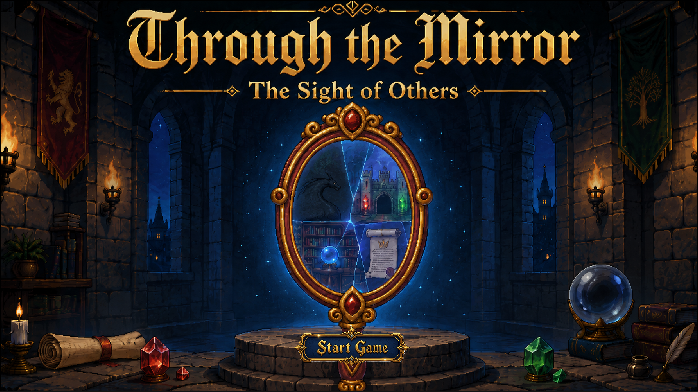
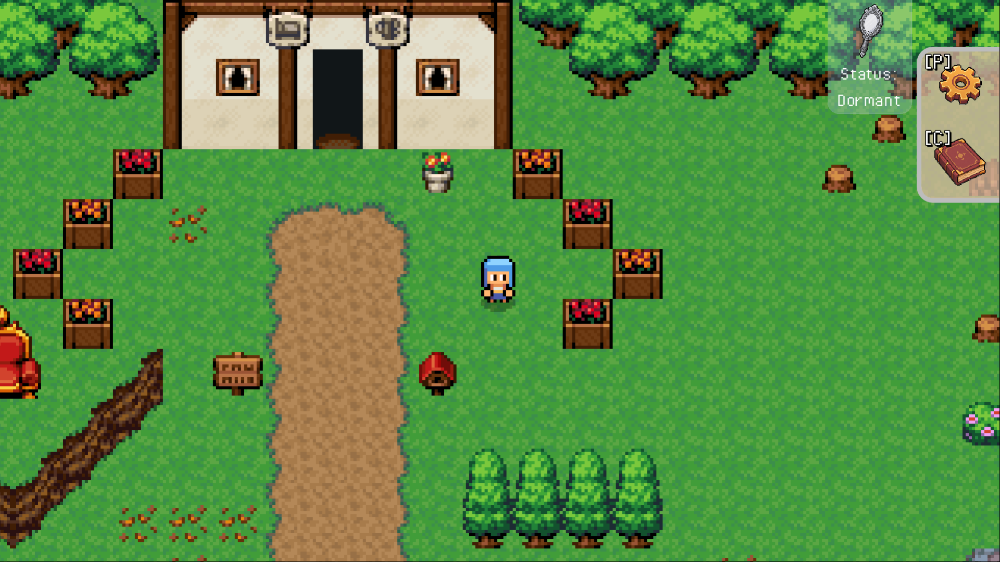
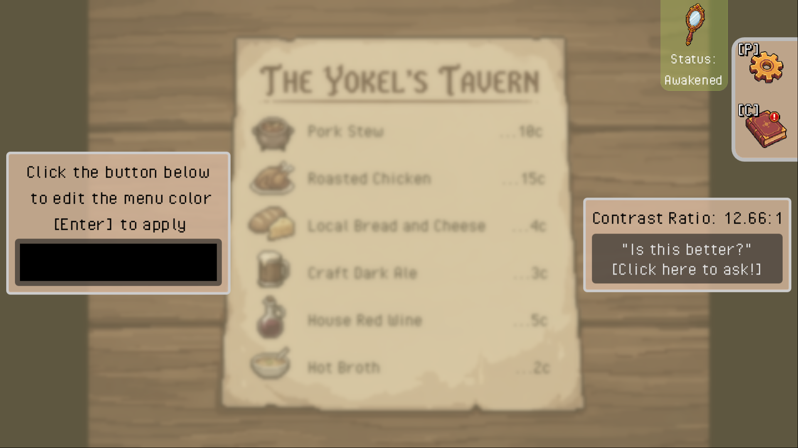
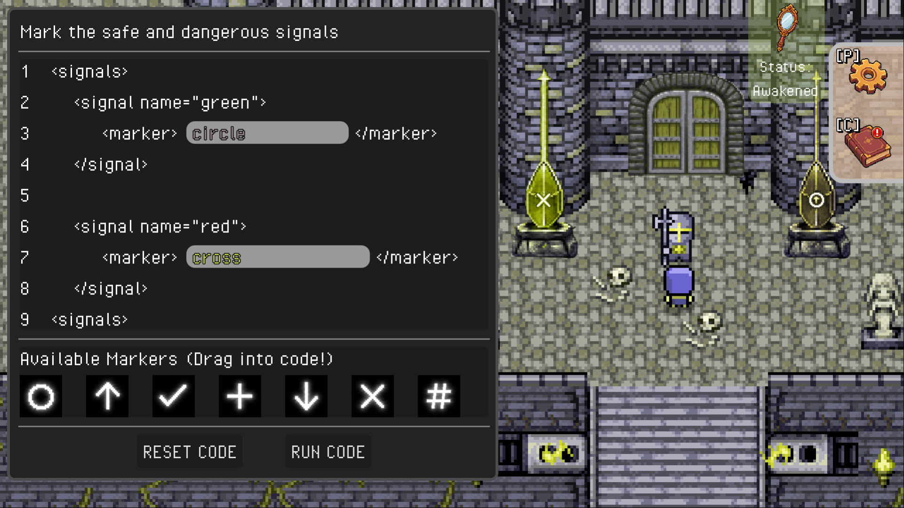
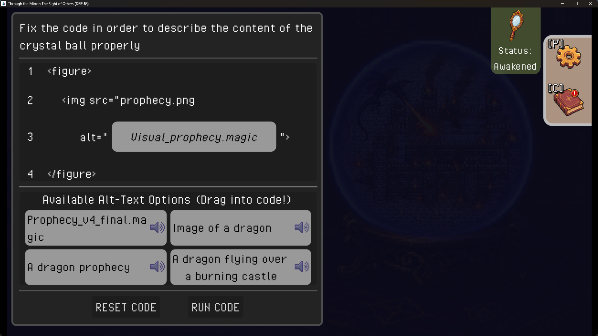
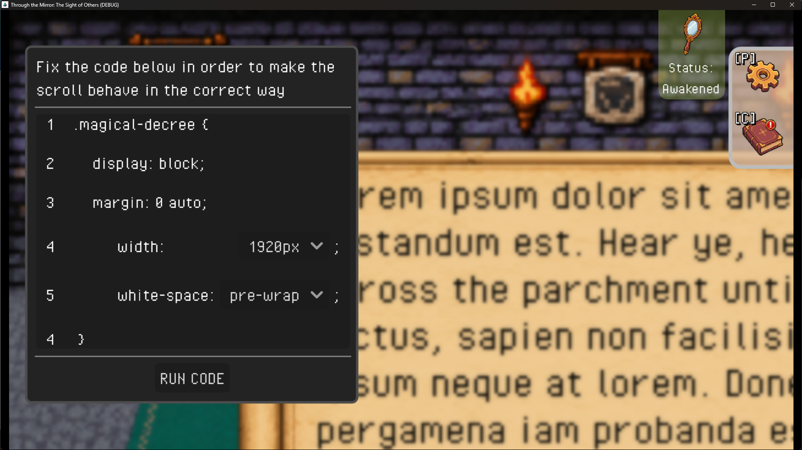
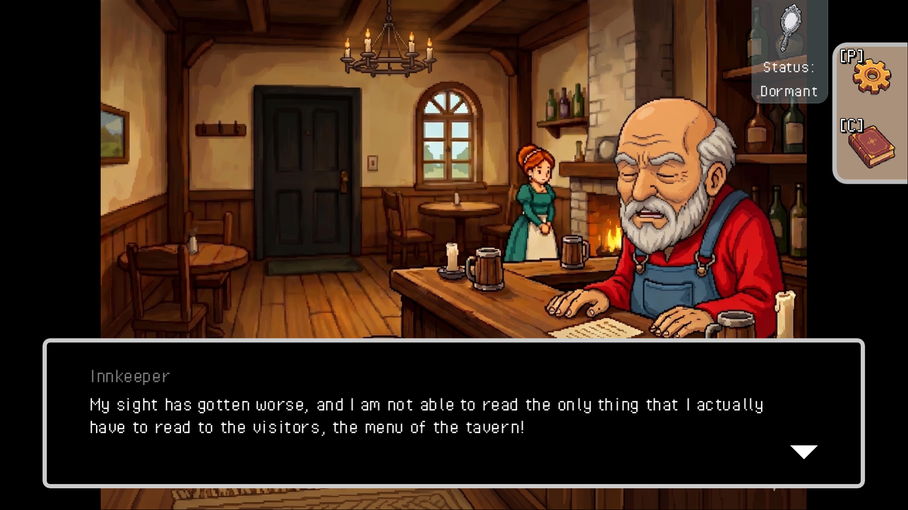
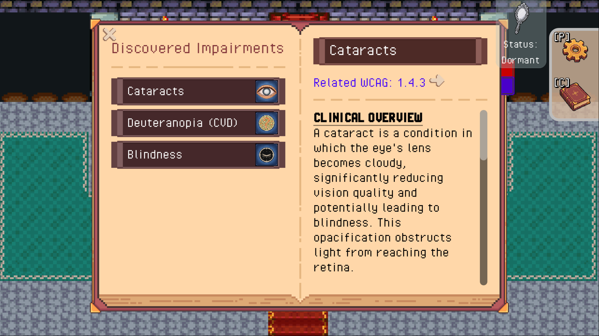
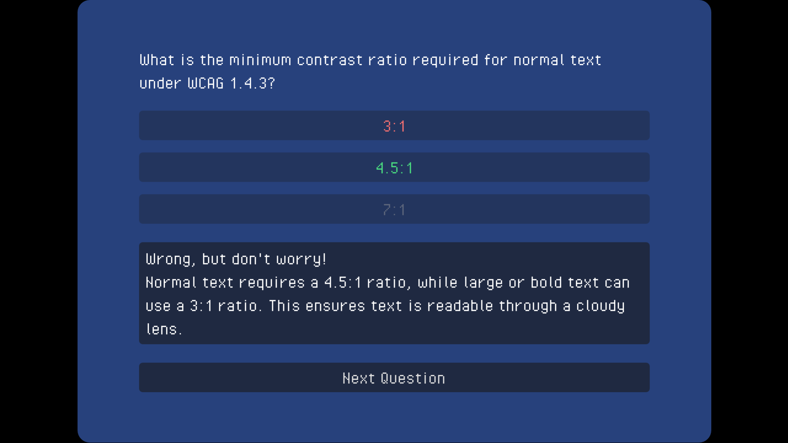
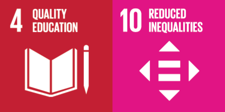

# Through the Mirror

**A narrative-driven serious game for learning about visual accessibility.**

Through the Mirror is a serious game developed as part of a Master's thesis in Computer Engineering. It combines interactive gameplay, visual simulations, narrative, and reflection activities to introduce players to visual accessibility and selected Web Content Accessibility Guidelines (WCAG).



## About the project

The player takes the role of a software developer who is transported to the fantasy world of **Lands of the Prism**. Guided by the inhabitants of the world, the player encounters different visual barriers and learns how accessibility issues can affect the way digital content is perceived and interacted with.

Rather than presenting accessibility only as a set of technical requirements, the game combines technical concepts with a narrative experience designed to encourage players to consider accessibility from the perspective of people who experience these barriers.

The project was developed in **Godot 4** and was designed primarily for students and developers with a technical background.

## Key features

* **Narrative-driven gameplay** combining exploration, dialogue, puzzles, and minigames
* **Interactive visual simulations** representing different accessibility barriers
* **Accessibility-focused challenges** based on selected WCAG success criteria
* **Resonance Codex** providing additional information about accessibility concepts
* **Reflection quiz** connecting gameplay experiences with accessibility principles
* **NPC-driven storytelling** introducing accessibility through the experiences of characters in the game
* **Local gameplay telemetry** recording anonymized session statistics for project evaluation



## Accessibility concepts

The game explores four different accessibility scenarios.

### Contrast and cataracts

The first scenario introduces issues related to insufficient contrast and simulates how reduced visual clarity can affect the perception of digital content.

**Related WCAG criterion:** 1.4.3 Contrast (Minimum)



### Color vision deficiency

A second scenario explores the problems that arise when color is used as the only means of communicating information.

**Related WCAG criterion:** 1.4.1 Use of Color



### Blindness and alternative text

The player encounters content that cannot be accessed visually and learns about the importance of providing text alternatives for non-text content.

**Related WCAG criterion:** 1.1.1 Non-text Content



### Low vision and reflow

The final scenario focuses on low vision and the importance of ensuring that content remains usable when enlarged or displayed within a constrained viewport.

**Related WCAG criterion:** 1.4.10 Reflow



## Narrative and learning

Accessibility concepts are introduced through the game's world rather than presented exclusively as standalone explanations.

The player interacts with characters, discovers accessibility-related information through the **Resonance Codex**, and encounters challenges that require applying the concepts introduced during the game.





At the end of the experience, a reflection quiz encourages players to connect the situations experienced in the game with the accessibility principles introduced throughout the journey.



## Technology

* **Godot 4**
* **GDScript**
* 2D game environments and character-based interactions
* Custom shaders for visual accessibility simulations
* Dialogue system for narrative interactions
* Custom gameplay minigames
* Local gameplay telemetry for evaluation

## Play the game

The game is available as a playable prototype on itch.io:

**[▶ Play Through the Mirror on itch.io](https://fra44.itch.io/through-the-mirror)**

The itch.io version provides the exported game build, while this repository contains the project's source code and development assets.

## Running from source

The project can also be opened directly with **Godot 4**.

1. Clone the repository.
2. Open the project in Godot 4.
3. Import the project when prompted.
4. Run the project.

The project was developed and tested using Godot 4.x.

## Evaluation

The game was developed as a research prototype and evaluated with participants from different backgrounds:

* **IT students**, representing the primary target audience of the educational experience
* **IT professionals**, providing feedback from a professional technical perspective
* **An accessibility professional**, providing domain-specific feedback on the accessibility concepts and their representation in the game

The evaluation combined gameplay experience, interviews, and questionnaires to investigate both the educational and narrative aspects of the prototype.

The project also includes a local telemetry system that records gameplay information such as level completion, failures, time spent, manual usage, and quiz results. The telemetry is kept locally and does not send data to an external server.

## Credits & third-party resources

The prototype was developed using the following external resources and tools.

### Assets and creative resources

| Resource                                                                            | Use in the prototype                                                                                                                              |
| ----------------------------------------------------------------------------------- | ------------------------------------------------------------------------------------------------------------------------------------------------- |
| [SmallburgTown Pack](https://almostapixel.itch.io/smallburg-town-pack)              | Player, innkeeper, and NPC sprites used in the village and tavern environments.                                                                   |
| [OpenRTPTiles](https://finalbossblues.itch.io/openrtp-tiles)                        | Main tileset used for the overworld, tavern, castle, and library environments.                                                                    |
| [Pixellab.ai](https://www.pixellab.ai/)                                             | Generation of character sprites, including the guard, archivist, and herald.                                                                      |
| ChatGPT image generation                                                            | Generation of cutscene images, impairment icons, Codex and Mirror icons, ray symbols, title screen imagery, and visuals used on the itch.io page. |
| [Complete UIBook StylesPack](https://crusenho.itch.io/complete-ui-book-styles-pack) | Visual basis for the open-book interface used by the Resonance Codex.                                                                             |

### Development tools

| Tool                                                          | Use in the prototype                                                                                          |
| ------------------------------------------------------------- | ------------------------------------------------------------------------------------------------------------- |
| [Godot Engine](https://godotengine.org/)                      | Game engine and development environment.                                                                      |
| [DialogueManager for Godot](https://dialogue.nathanhoad.net/) | Dialogue and narrative system used to structure dialogue files and trigger game events through dialogue tags. |
| [Piskel](https://www.piskelapp.com/)                          | Pixel-art editing tool used to adjust and refine generated and external assets.                               |

Third-party assets are used in accordance with their respective licenses and attribution requirements.

> **License note:** The MIT License applies to the original source code and
> project materials created for this repository. Third-party assets, tools,
> libraries, and other external resources are not covered by this license and
> remain subject to their respective licenses and terms of use.

## Sustainable Development Goals

The project aligns with two United Nations Sustainable Development Goals:

* **SDG 4 – Quality Education:** the game explores an interactive approach to learning about digital accessibility and accessibility standards.
* **SDG 10 – Reduced Inequalities:** by encouraging players to understand visual accessibility barriers, the project promotes awareness of inclusive digital experiences and barriers faced by people with disabilities.



## Project structure

```text
ThroughTheMirror/
├── addons/             # Third-party Godot addons
├── assets/             # Game assets
├── dialogue/           # Dialogue resources
├── entities/           # Player and NPC entities
├── global/             # Global managers and systems
├── scenes/             # Game scenes and gameplay systems
├── ui/                 # User interface and accessibility systems
├── docs/
│   ├── screenshots/    # Screenshots used in this README
│   └── sdgs.png        # Sustainable Development Goals
├── project.godot
└── export_presets.cfg
```

## Context

Through the Mirror was developed as a Master's thesis project in **Computer Engineering**, with a focus on human-computer interaction, accessibility, and educational game design.

The project explores how game mechanics and narrative can be used to introduce technical accessibility concepts while encouraging players to consider accessibility from a human-centred perspective.
